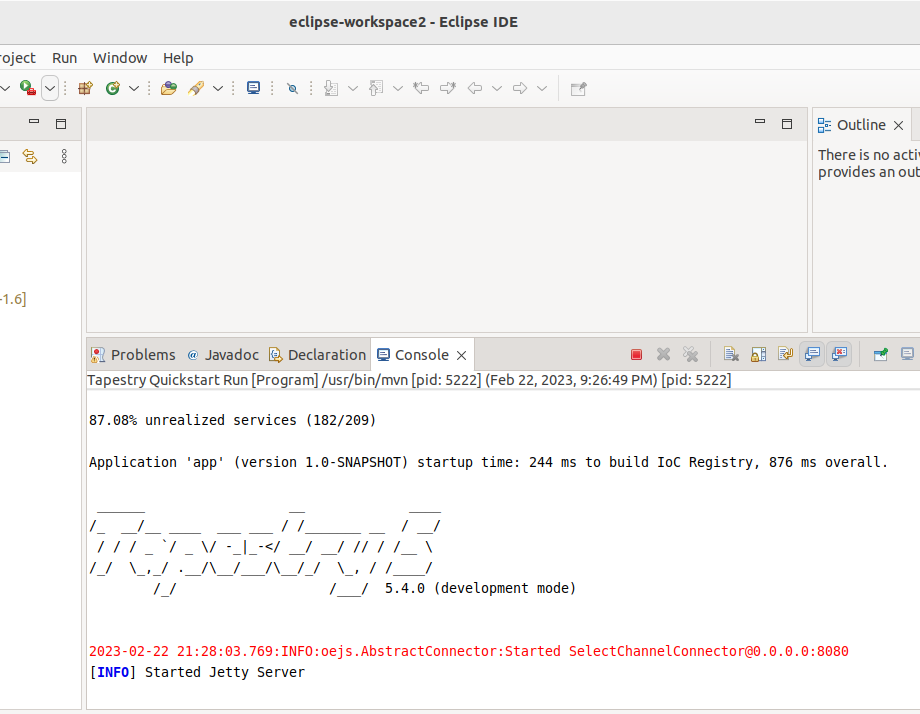

# Tapestry quickstart development environment
## Description

This guide provides all the steps necessary to run the Apache Tapestry Quickstart project in a development environment. This is usefull to perform testing with a debugger running.

## Setup

_This procedure uses the Eclipse IDE for the development environment. This choice follows the official Apache Tapestry recommendation in terms of support._

### Requirements

All versions are to be chosen based on the targeted Apache Tapestry version and in accordance with the [Tapestry version table](../README.md#tapestry-version-table).

#### Java
##### OpenJDK 1.7

Ubuntu (<= 14.04)
```
apt-get update
apt-get install -y openjdk-7-jdk
```

RHEL7/Centos 7
```
yum install -y java-1.7.0-openjdk-devel
```

##### OpenJDK 11
Ubuntu (22.04)
```
apt-get update
apt-get install -y openjdk-11-jdk
```

RHEL8/RockyLinux 8/AlmaLinux 8
```
dnf install -y java-11-openjdk-devel
```

#### Maven
Ubuntu (14.04, 22.04)
```
apt-get update
apt-get install -y maven
```

RHEL7/Centos 7/RHEL8/RockyLinux 8/AlmaLinux 8
```
yum install -y maven
```

#### xmlstarlet (only with JDK 1.7)
Ubuntu (14.04)
```
apt-get update
apt-get install -y xmlstarlet
```

RHEL7/Centos 7
```
yum install -y xmlstarlet
```

#### Eclipse IDE

Ubuntu (14.04)
```
apt-get update
apt-get install -y eclipse
```

Ubuntu (22.04)
```
snap install --classic eclipse
```

RHEL7/Centos 7
```
curl -LO https://www.eclipse.org/downloads/download.php?file=/technology/epp/downloads/release/2019-09/R/eclipse-java-2019-09-R-linux-gtk-x86_64.tar.gz
tar -zxvf eclipse-java-2019-09-R-linux-gtk-x86_64.tar.gz -C /opt
ln -sf /opt/eclipse/eclipse /usr/bin/eclipse
```

RHEL8/RockyLinux 8/AlmaLinux 8
```
curl -LO 'https://www.eclipse.org/downloads/download.php?file=/technology/epp/downloads/release/2022-12/R/eclipse-java-2022-12-R-linux-gtk-x86_64.tar.gz&mirror_id=1'
tar -zxvf eclipse-java-2019-09-R-linux-gtk-x86_64.tar.gz -C /opt
ln -sf /opt/eclipse/eclipse /usr/bin/eclipse
```

### Eclipse setup
#### Setup Tapestry quickstart

All versions are to be chosen based on the targeted Apache Tapestry version and in accordance with the [Tapestry version table](../README.md#tapestry-version-table) and the [version correspondance table](../README.md#version-correspondance-table).

Retrieve this project
```
git clone https://github.com/ndmalc/tapestry-quickstart-docker.git
cd tapestry-quickstart-docker/build
```

Define version of the different dependencies based on Tapestry version.
```
export TAPESTRY_VERSION=5.X.X
export JDK_VERSION=XX
export JETTY_VERSION=X.X.X.vXXXXXXXX
export MVN_ARCHETYPE_PLUGIN_VERSION=X.X.X
```

Configure Maven if needed
```
if [ $JDK_VERSION == "1.7" ]; then
    cp -R .m2 ~/.m2
fi
```

Retrieve Tapestry quickstart archetype
```
mvn \
    -DarchetypeGroupId=org.apache.tapestry \
    -DarchetypeArtifactId=quickstart \
    -DarchetypeVersion=${TAPESTRY_VERSION} \
    -DarchetypeCatalog=local \
    -DgroupId=com.example \
    -DartifactId=newapp \
    -Dversion=1.0-SNAPSHOT \
    -Dpackage=com.example.newapp \
    -Dbasedir=./ \
    -Darchetype.interactive=false \
    --batch-mode \
    org.apache.maven.plugins:maven-archetype-plugin:${MVN_ARCHETYPE_PLUGIN_VERSION}:generate
```

Patch application when needed
```
if [ -f patch/patch_pom_${TAPESTRY_VERSION}.sh ]; then /bin/bash patch/patch_pom_${TAPESTRY_VERSION}.sh; fi
if [ -f patch/patch_file_${TAPESTRY_VERSION}.sh ]; then /bin/bash patch/patch_file_${TAPESTRY_VERSION}.sh; fi
```

Download dependencies & build application
```
mvn install --batch-mode -Dmaven.test.skip=true
mvn --batch-mode org.mortbay.jetty:jetty-maven-plugin:${MVN_ARCHETYPE_PLUGIN_VERSION}:help
```

Setup is now finished.

#### Setup Eclipse project

Procedure gives detail to run Tapestry quickstart in debug mode as it is the most interesting mode to instropect the project's inner activity.

1. Open Eclipse IDE

2. Import project
- `File > Import`


3. Select Maven project type
- `Maven > Existing Maven Projects`


4. Select directory path of Tapestry quickstart project & select pom.xml from root folder of project


5. Project is imported


6. Configure new run configuration
- `Run application > External tools configurations...`


7. New configuration
- `Program > New configuration`


8. Configure configuration's 'Main' tab
- `Main > Location: /usr/bin/mvn`
- `Main > Working Directory: ${workspace_loc:/newapp}`
- `Main > Arguments: org.mortbay.jetty:jetty-maven-plugin:X.X.X.vXXXXXXXX:run (replace X with appropriate version)`


9. Configure configuration's 'Environment' tab
- `Environment > Variable: MAVEN_OPTS / -Xdebug -Xnoagent -Djava.compiler=NONE -Xrunjdwp:transport=dt_socket,address=4000,server=y,suspend=y`


10. Configure new debug configuration
- `Debug > Debug configurations...`


11. New Remote Java Application
- `Remote Java Application > New Configuration`


12. Configure new configuration
- `Connect > Project: newapp`
- `Connect > Connection Properties: Port: 4000`


13. Launch run then launch debug. Debugger is remotelly connecting to Jetty server and application is running




_Note: Procedure is written and tested based on Ubuntu 22.04 system and Eclipse IDE for Java Developers 2022-12_

### Version correspondance table

| Dependency | Dependency version in table | Corresponding dependency value |
| ---------- | --------------------------- | ------------------------------ |
| JDK | 1-7 | 1.7 | 7 |
| JDK | 11 | 11 | 11 |
| Jetty | 7-6-0 | 7.6.0.v20120127 |
| Jetty | 8-0-0 | 8.0.0.v20110901 |
| Maven Archetype Plugin | 2-4 | 2.4 |
| Maven Archetype Plugin | 3-2-1 | 3.2.1 |

## Links

- https://tapestry.apache.org/
- https://askubuntu.com/questions/761127/how-do-i-install-openjdk-7-on-ubuntu-16-04-or-higher
- https://www.itzgeek.com/how-tos/linux/centos-how-tos/install-eclipse-4-4-luna-ide-on-centos-7-rhel-7.html
- https://tapestry.apache.org/creating-the-skeleton-application.html